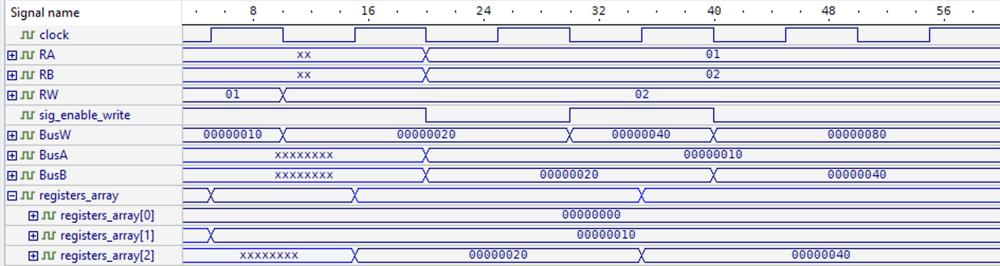
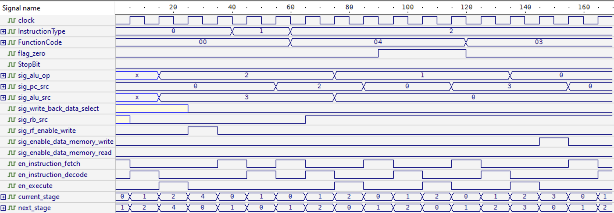

                    ╔════════════════━━──── • ────━━━═══════════════╗

                                Simple RISC Verilog Processor

                    ╚═══════════════━━━──── • ────━━━═══════════════╝

---

# Simple RISC Verilog Processor 💻

Second project in the computer architicture course (ENCS4370) at [Birzeit University](https://www.birzeit.edu/)

A Simple multi-cycle RISC Verilog processor with architecture similar to MIPS

## Partners

```
👷 Ibraheem Alyan  1201180
👷 Mohammad Mualla 1180546
👷 Feras Sandouka  1200779
```

---

## [Project ( Requirements )](./Project_Paper.pdf)

---

## Data Path


## Naming Convention

- `{sig/flag}_{snack_case_name}` for signals/flags
- `{snack_case_name}` for internal components ( registers / wires )
- `{camel_case_name}` for modules
- `{pascal_case_name}` for input/output ports ( excluding signals )

## Modules

### Register file

- [register_file.v](./processor_modules/RiscProcessor/processor/src/register_file/register_file.v)
  a 32 bit register file with 32 registers
- [register_file_tb.v](./processor_modules/RiscProcessor/processor/src/register_file/register_file_testbench.v)
  test bench for the register file module
- waveform
  

### Instruction memory

- [instruction_memory.v](./processor_modules/RiscProcessor/processor/src/instruction_fetch/InstructionMemory.v)
  a 32 bit instruction memory with 256 words
- [instruction_memory_tb.v](.processor_modules/RiscProcessor/processor/src/instruction_fetch/instruction_memory_testbench.v)
  test bench for the instruction memory module
- waveform
  

### Data memory

- [data_memory.v](./processor_modules/RiscProcessor/processor/src/data_memory/data_memory.v)
  a 32 bit data memory with 256 words

- [data_memory_tb.v](./processor_modules/RiscProcessor/processor/src/data_memory/data_memory_testbench.v)
  test bench for the data memory module

- waveform
  

### ALU

- [alu.v](./processor_modules/RiscProcessor/processor/src/alu/alu.v)
  a 32 bit ALU with 5 operations ( ADD, SUB, AND, SL, SR ) and 2 flags ( zero, negative )

- [alu_tb.v](./processor_modules/RiscProcessor/processor/src/alu/alu_testbench.v)
  a test bench for the ALU module that tests all operations and the flags

- waveform
  

### PC Module

- [pc_module.v](./processor_modules/RiscProcessor/processor/src/instruction_fetch/pc_module.v)
  a 32 bit program counter logic module that handles Jump/Conditional Branches/Increment/Return

- [pc_module_tb.v](./processor_modules/RiscProcessor/processor/src/instruction_fetch/pc_module_testbench.v)
  a test bench for the PC module that tests all operations

- waveform
  

### Stack Module ( LIFO Memory )

- [stack.v](./processor_modules/RiscProcessor/processor/src/stack/stack.v)
  a 32 bit stack module that handles push/pop operations on Last-In-First-Out memory and has a 32 word capacity

- [stack_testbench.v](./processor_modules/RiscProcessor/processor/src/stack/stack_testbench.v)
  a test bench for the stack module that tests all operations

- waveform
  

## Control Unit ( FSM )

- [control_unit.v](./processor_modules/RiscProcessor/processor/src/control_unit/control_unit.v)
  a control unit that handles the control signals for the processor

- [control_unit_tb.v](./processor_modules/RiscProcessor/processor/src/control_unit/control_unit_testbench.v)
  a test bench for the control unit that tests all operations

- R/I Type Arithmatic/Logical Operations Waveform
  
- Jump/Branch Operations Waveform
  

## Addition Loop Program

- code:

  ```assembly
  ADDI R1, R0, 2
  ADDI R2, R0, 3
  ADD R3, R2, R1
  ADD R3, R3, R3
  J -4 ; jumps to previous ADD
  ```

- waveform
  

## Shifts Program

- code:

  ```assembly
  ADDI R1, R0, 'b1000
  ADDI R2, R0, 'b1110
  AND R3, R2, R1 ; R3 = 1000 & 1110 = 1000
  ADDI R4, R0, 'd2
  SLR R5, R3, 'd3 ; R5 = 1000 >> 3 = 0001
  SLLV R6, R3, R4 ; R6 = 1000 << 2 = 0010 0000
  J -4 ; jumps to previous ADD
  ```

- waveform
  
